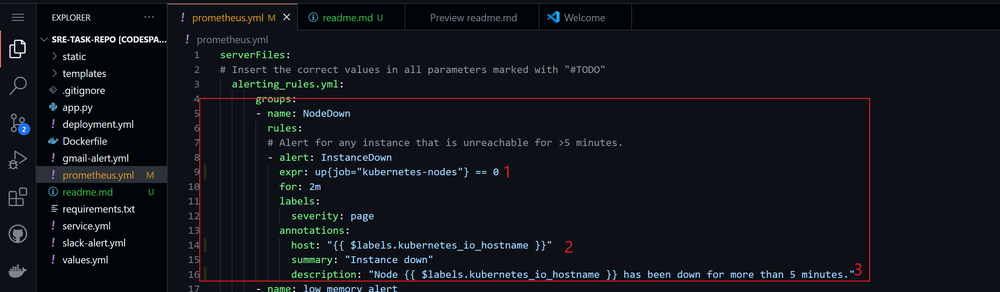
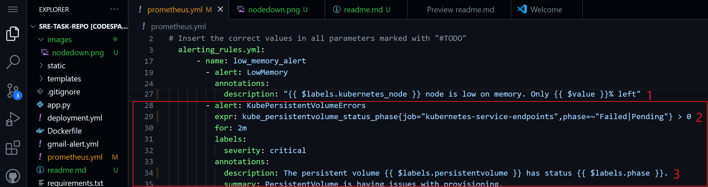
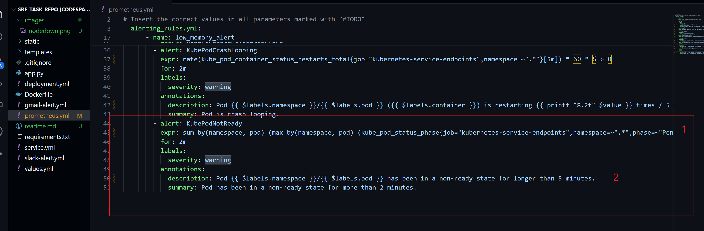

# Introduction

In this project, you'll be tasked with deploying UpCommerce's website as a service on Kubernetes. You'll define alert rules based on key performance indicators (KPIs) like CPU utilisation, memory usage, and request rates, allowing you to detect and respond to potential issues before they affect the user experience. You'll create and deploy these rules using Prometheus. Prometheus is an open-source monitoring and alerting system designed for containerized environments, such as Kubernetes. It collects and stores metrics from various sources, including applications, infrastructure components, and custom exporters, allowing you to monitor the performance and health of your systems in real-time. Prometheus uses a powerful query language called PromQL to analyze and visualize the collected metrics, enabling you to gain valuable insights into the behavior of your applications and infrastructure.

By the end of this project, you'll have a comprehensive view of the UpCommerce website, enabling you to identify trends, patterns, and potential issues that may affect the user experience or the overall stability of the system. You'll also have gained hands-on experience in managing a production-grade e-commerce platform and the skills necessary to maintain its reliability and performance.

# Getting your development environment ready

For this project, you'll be using GitHub Codespaces to deploy UpCommerce's service infrastructure because GitHub Codespaces has all the tools we require for this project (Minikube, Docker, Helm, Git, etc). If this is your first encounter with GitHub Codespaces

## Steps

1. Create a fork of the week's [repository.](https://github.com/onyekaugochukwu/sre-task-repo)

2. When you have created a fork of the week's repository, start a codespace on the main branch (unless you created another branch after you created your fork of the repository).

3. Run the command below in your Codespace's terminal to create a single-node, Kubernetes cluster using Minikube: 

`minikube start`

4. Once your Minikube cluster is running, enter the command below:

`kubectl create namespace sre`

5. Task 1: Define your Prometheus configuration in the prometheus.yml file before you run the command in Step 6 below. Define the alert rules and triggers that should fire off the alerts. You need to add the following alerts to the prometheus.yml file by changing the values of all the fields marked with "#TODO" in the prometheus.yml file:

     (a). Node Down Alert Group

    - This alert should be triggered under the following scenarios:

       - When a Kubernetes node is unreachable for more than 5 minutes.
    - The alert rule should include:

    - Alert Name: InstanceDown

    - Expression: up{job="kubernetes-nodes"} == 0

    - Trigger Duration: 2 minutes

    - Labels:

      - severity: page

    - Annotations:

      - host: "{{ $labels.kubernetes_io_hostname }}"

      - summary: "Instance down"

      - description: "Node {{ $labels.kubernetes_io_hostname }} has been down for more than 5 minutes."

      

(b). Low Memory Alert

  - This alert should be triggered when a Kubernetes node's available memory falls below 85%.

    - The alert rule should include:

      - Alert Name: LowMemory

      - Expression: (node_memory_MemAvailable_bytes / node_memory_MemTotal_bytes) * 100 < 85

      - Trigger Duration: 2 minutes

      - Labels:

        - severity: warning

  - Annotations:

    - host: "{{ $labels.kubernetes_node }}"

    - summary: "{{ $labels.kubernetes_node }} Host is low on memory. Only {{ $value }}% left"

    - description: "{{ $labels.kubernetes_node }} node is low on memory. Only {{ $value }}% left"

    

(c). Kube Persistent Volume Errors Alert

 - This alert should be triggered if any persistent volume has a status of "Failed" or "Pending".

 - The alert rule should include:

   - Alert Name: KubePersistentVolumeErrors

   - Expression: kube_persistentvolume_status_phase{job="kubernetes-service-endpoints",phase=~"Failed|Pending"} > 0

   - Trigger Duration: 2 minutes

   - Labels:

      - severity: critical

   - Annotations:

      - description: The persistent volume {{ $labels.persistentvolume }} has status {{ $labels.phase }}.

      - summary: PersistentVolume is having issues with provisioning.

(d). Kube Pod Crash Looping Alert

 - This alert should be triggered if any Kubernetes pod is restarting more than once every 5 minutes.

 - The alert rule should include:

  - Alert Name: KubePodCrashLooping

  - Expression: rate(kube_pod_container_status_restarts_total{job="kubernetes-service-endpoints",namespace=~".*"}[5m]) * 𝟼𝟶 * 𝟻 > 𝟶

  - Trigger Duration: 2 minutes

    - Labels:

      - severity: warning

  - Annotations:

     - description: Pod {{ $labels.namespace }}/{{ $labels.pod }} ({{ $labels.container }}) is restarting {{ printf "%.2f" $value }} times / 5 minutes.

     - summary: Pod is crash looping.

(e). Kube Pod Not Ready Alert

- This alert should be triggered if any Kubernetes pod remains in a non-ready state for longer than 2 minutes.

- The alert rule should include:

  - Alert Name: KubePodNotReady

  - Expression: sum by(namespace, pod) (max by(namespace, pod) (kube_pod_status_phase{job="kubernetes-service-endpoints",namespace=~".*",phase=~"Pending|Unknown"}) * on(namespace, pod)    group_left(owner_kind) topk by(namespace, pod) (1, max by(namespace, pod, owner_kind) (kube_pod_owner{owner_kind!="Job"}))) > 0

  - Trigger Duration: 2 minutes

  - Labels:

   - severity: warning

  - Annotations:

   - description: Pod {{ $labels.namespace }}/{{ $labels.pod }} has been in a non-ready state for longer than 5 minutes.

   - summary: Pod has been in a non-ready state for more than 2 minutes."

